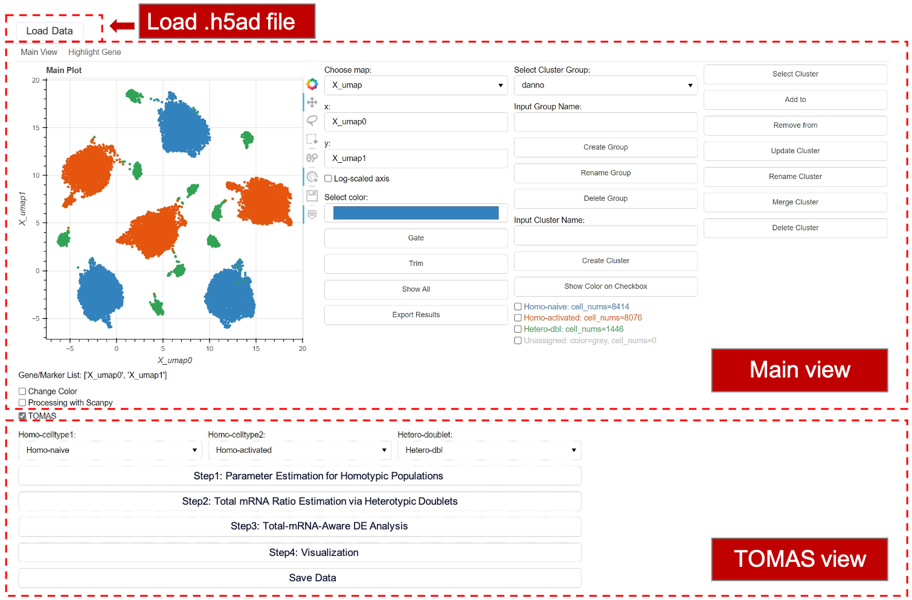
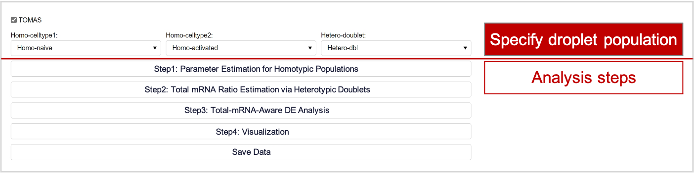
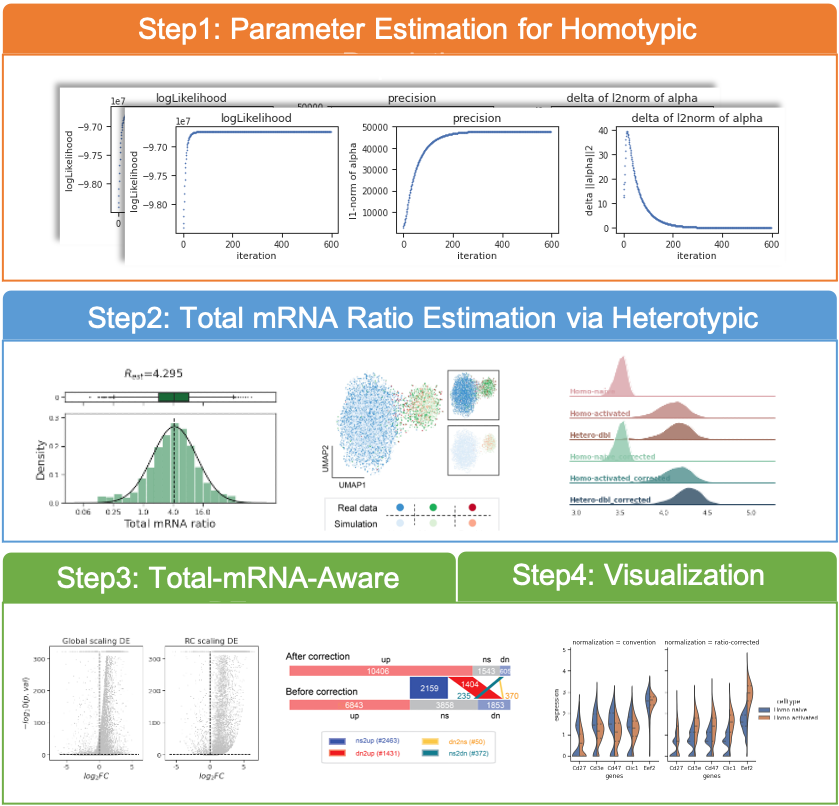

Graphical interface
===================

In this tutorial, we introduce a "code-free" way to run TOMAS. It supports all analyses in forementioned two tutorials via friendly graphical interface. All results can be easily downloaded for additional analysis.

TOMAS's GUI is developed based on **PANTHEON**, a graphical platform tailored towards scRNA-seq data analyais. To use TOMAS's GUI, first download and install `PANTHEON <https://github.com/xinzhu-email/Pantheon>`_. Then start it by:

.. code-block:: console

   (.venv) $ bokeh serve --show main.py

Then an interactive interface would be built with your default web browser, as showed below.

  

For the **TOMAS** view, you need to first assign droplet populations, followed by running analytical steps through clicking corresponding buttons.

  

The results would be generated automatively.

  
