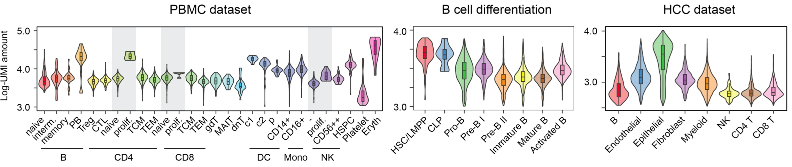

.. image:: _static/img/logo_h3.png
  :width: 600
  :align: center
  
.. image:: _static/img/empty.png

TOMAS: Total-mRNA-aware single cell analysis
============================================

**TOMAS** is a Python package for **TO**\tal-**M**\RNA-**A**\ware **S**\ingle-cell RNA-seq data analysis. Check out the :doc:`tutorials` section for further information and :doc:`installation` for how to install the project.

Widely observed total mRNA differences
--------------------------------------

.. admonition:: Literature for total mRNA differences in cells

    * 10-fold increase of mRNA molecules during B-cell activation [Kouzine13]_. 
    * ~ twofold greater total RNA per cell in mouse activated lymphocytes compared to their serum-starved counterparts [Nie2012]_. 
    * Defects in MeCP2 could lead to a 50% reduction in total RNA per cell in human neurons [Li2013]_. 
    * It is estimated that naive CD4+ T cells contain ~77k mRNA molecules, compared to an estimated number of ~420k mRNA molecules in activated CD4+ T cells [Wolf2020]_.
    
* Observation of differences in UMI amounts of various cell types

.. image:: _static/img/empty.png

Misleading results when ignoring large total mRNA differences
-------------------------------------------------------------

* Impact of the total mRNA differences between cell types on `DE analysis` 

.. figure:: _static/img/schematic_DE.jpg
   :align: center
   :width: 650
   :alt: Schematics illustrating the impact of the total mRNA differences between cell types on DE analysis

* Impact of the total mRNA differences between cell types on `Gene Set Enrichment Analyses (GSEA) analysis` 

.. figure:: _static/img/schematic_GSEA.jpg
   :align: center
   :width: 650
   :alt: Example demonstrating different total mRNA ratio assumptions lead to different interpretation

.. image:: _static/img/empty.png

Overview of TOMAS
-----------------

TOMAS infers the total mRNA ratio between a pair of cell groups by deconvoluting their respective heterotypic doublets. Doublets in scRNA-seq can be classified into:

* `homotypic doublets`, which have two cells of the same type or state
* `heterotypic doublet`, which have two cells of different types or states

Since scRNA-seq captures mRNA molecules through hybridizing poly-A tails, which is present in all mRNA molecules, in this work **we assume mRNA molecules in a `heterotypic doublets` are randomly sampled indiscriminately, regardless of their cell origins**. 

.. figure:: _static/img/overview.png
   :align: center
   :width: 650
   :alt: The overview of TOMAS
   

Based on this assumption, the ratios of captured mRNA molecules (also known as Unique Molecular Identifier/UMI counts) between the two member cells within individual heterotypic doublets can be thought as representatives of the true total mRNA content ratios between the two cell types. 

By deconvoluting the captured mRNA molecules by cell type in heterotypic doublets, therefore, we can gain insights about the true mRNA content ratios. 

Cite us
-------

The details can be found in `our paper on bioRxiv <xxxx>`_. 

.. toctree::
   :maxdepth: 1
   :hidden:

   tutorials
   installation
   api
   contributors
   references

   

