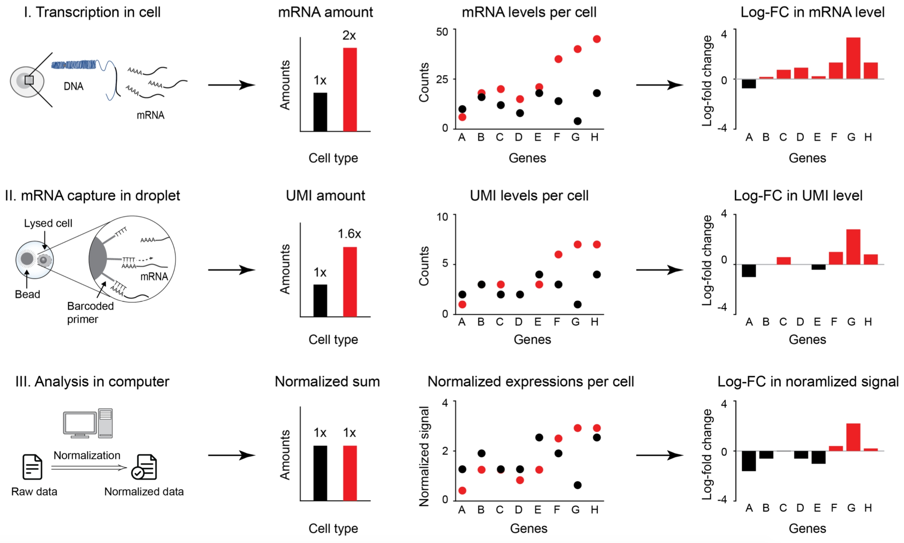
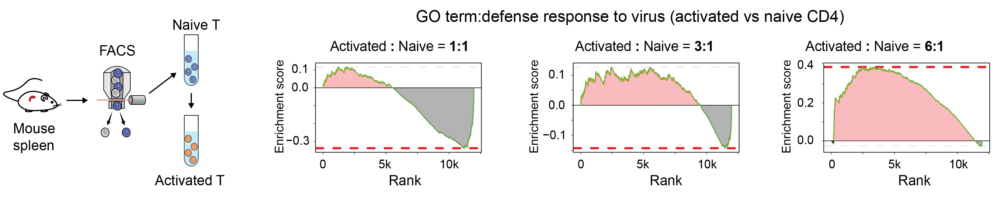
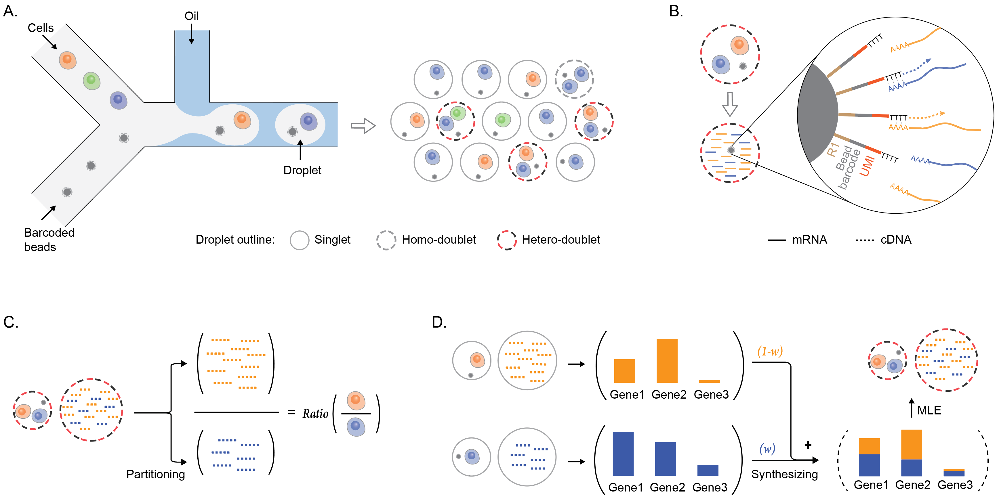

.. image:: _static/img/logo_h2.png
  :width: 600
  :align: center
  

TOMAS: Total-mRNA-aware single cell analysis
============================================

What
----

**TOMAS** is a Python package for **TO**\tal-**M**\RNA-**A**\ware **S**\ingle-cell RNA-seq data analysis. Check out the :doc:`tutorials` section for further information and :doc:`installation` for how to install the project.

Controlling **global abundance differences** is a corner stone in many quantitative biological measurements. Bulk-RNA-seq and microarray platforms use spike-in controls (also known as ERCC) to quantify global shifts in total DNA/RNA content size between cell populations under comparison [citation1]_. In the realm of droplet-based scRNA-seq, however, due to its poor compatibility with ERCC [citation2]_, a widely applicable control for total mRNA content size differences is yet to be found.

.. admonition:: Literature for variations of total mRNA content in cells

    * Kouzine et al. reported a more than 10-fold increase of mRNA molecules during B-cell activation [Kouzine13]_. 
    * Nie et al. observed ~ twofold greater total RNA per cell in mouse activated lymphocytes compared to their serum-starved counterparts [57]. 
    * Li et al. found that defects in MeCP2 could lead to a 50% reduction in total RNA per cell in human neurons [58]. 
    * xxx et al. estimated that naive CD4+ T cells contain ~77k mRNA molecules, compared to an estimated number of ~420k mRNA molecules in activated CD4+ T cells [citation2]_..
    

Instead, assuming that all cells, regardless of their cell type and cell state differences, share a common total mRNA content size distribution has been widely accepted as a silent compromise in scRNA-seq analysis [8,9,10]. Yet, prior workshave provided mounting evidence that in bulk-RNA-seq, total mRNA content size differences, when left uncontrolled, couldprofoundly confound downstream differential expression (DE) and gene set enrichment analyses (GSEA) [11,12,13,14]. Inthe original work by Lóven et al., the authors showed that ignoring total mRNA differences between samples in DE analysiscould lead to significant over- and under-estimations, thereby introducing a bias we termed the **population bias**. In the most extreme cases where the total mRNA content size differences are large, population biases may completely invert the DE directions for a significant number of important genes.

Why
---

Similar to bulk RNA-seq, **ignoring large differences in total mRNA content could heavily mislead downstream analyses in singel cell analysis**. Consider the example showed in the figure below, which illustrates the true gene expressions of two cell types. In this example, both cell types express a similar set of genes, but one cell type (in red) produces and accumulates 200\% of the total mRNA molecules than the other cell type (in black). After DE analysis, we can observed increased expressions in most genes except for gene A. After scRNA-seq, because of reduced mRNA recovery rates in cells with higher mRNA contents, differences in the number of captured mRNA molecules between the two cell types reduce to 1.6X, as shown in the second panel plots. Directly applying DE analysis on the raw scRNA-seq output would lead to smaller-than-truth fold changes in most genes (comparing the DE result in the first panel against the DE result in the second panel), with gene E completely switched direction from up-regulation to down-regulation. Conventional approaches that normalize the total mRNA contents between the two cell types would further amplify this error, which is evident in the third panel plots. As both cell types are assumed to have equal total mRNA contents, greater expressions in some genes must be balanced by reduced expressions in others. Consequently, DE analysis produces even more erroneous results with more genes being mis-characterized from up-regulation to down-regulation while the rest having much reduced fold changes, as demonstrated in the DE result. 

   
   Schematics illustrating the impact of the total mRNA differences between cell types on DE analysis

**Besides DE analysis, Gene Set Enrichment Analyses (GSEA) is also sensitive to total mRNA differences between cell types and states**. For instance, when analyzing the ''defense response to virus'' gene set of an in-house naive-and-activated CD4+ T cell scRNA-seq dataset, we found that the GSEA result is highly dependent on the normalization scheme. Such dependency is illustrated in figure below: when the total gene mRNA counts of both cell types are normalized to *the same level*, not only half of the genes within the gene set are designated as down-regulated in activated T cells, the entire gene set is given a negative enrichment score with an inconclusive running-sum statistic curve (containing notable net-positive and net-negative segments at once). Such result indicates that the defense response to virus is more likely to be enriched in naiive T cells rather than activated T cells, which is counter-intuitive and difficult to interpret. When the total mRNA counts of activated CD4+ T cells are normalized to *3X* of naive CD4+ T cells, fewer genes in the set are designated as down-regulated, but the overall enrichment score remains negative, although now with a greater net-positive section in the running-sum statistic curve. Only when the total mRNA counts of activated CD4+ T cells are normalized to *6X* of naiive CD4+ T cells, a large majority of the gene set become up-regulated, with a net-positive enrichment score and a mostly-positive running-sum statistic curve. At last we have a typical running-sum statistic curve of an enriched gene set, which is perhaps the most aligned with our anticipation, where immune activities intensify after T cell activation. However, without the precise knowledge about the total mRNA differences between naive and activated T cells, it remains a question as which result is the closest to the truth.

   
   Example demonstrating different total mRNA ratio assumptions lead to different interpretation
   

How
---

TOMAS infers the total mRNA ratio between a pair of cell groups by deconvoluting their respective heterotypic doublets. Doublets in scRNA-seq can be classified into homotypic doublets and heterotypic doublets, with the former having two cells of the same type or state and the latter having two cells of different types or states. A visual example of singlets, homotypic doublets and heterotypic doublets is provided in Figure~\ref{fig:overall}A. While heterotypic doublets are commonly perceived as experimental noise in scRNA-seq and are avoided at all cost, we discover that they are a potential instrument for total mRNA ratio inference as they contain mRNA molecules from both member cells. Since scRNA-seq captures mRNA molecules through hybridizing poly-A tails, which is present in all mRNA molecules, in this work **we assume mRNA molecules in a heterotypic doublets are randomly sampled indiscriminately, regardless of their cell origins** (Figure~\ref{fig:overall}B). Based on this assumption, the ratios of captured mRNA molecules (also known as Unique Molecular Identifier/UMI counts) between the two member cells within individual heterotypic doublets can be thought as representatives of the true total mRNA content ratios between the two cell types. By deconvoluting the captured mRNA molecules by cell type in heterotypic doublets, therefore, we can gain insights about the true mRNA content ratios, as Figure~\ref{fig:overall}C shows. 

The main challenge in heterotypic doublet deconvolution is that individual mRNA molecules are indistinguishable by cell types. Fortunately, for the purpose of total mRNA ratio inference, it is unnecessary to trace the origin of individual mRNA molecules. Rather, the ratio can be indirectly inferred by synthesizing synthetic heterotypic doublets from *homotypic droplets* (singlets and homotypic doublets). TOMAS first constructs the probabilistic profiles of both cell types by analyzing their respective homotypic droplet populations. It then fuses the two probabilistic profiles with a parametrized mixture ratio to produce the probability profile of the synthetic doublet. Given a heterotypic doublet, TOMAS tunes the mixture ratio until the synthetic heterotypic doublet is the most analogous to the real one. as Figure~\ref{fig:overall}D shows. To account for biological variations of cells within cell types, TOMAS adopts a Bayesian framework: it models the UMI count distribution across genes in a homotypic droplet with a Dirichlet-Multinomial distribution, with the Dirichlet distribution serving as a prior that represents biological variations within the cell type population. Based on prior discoveries, TOMAS models the total UMI counts of individual cell types with log-Normal distributions. The mixture ratios of individual heterotypic doublets are collected to model the total mRNA content ratio distributions across cell types, which are incorporated into downstream DE and GSEA analyses for population bias correction.

   
   The overview of TOMAS. (A) The workflow of droplet-based scRNA-seq. Cells are partitioned into droplets for cell lysis and reverse transcription. Droplets, depending on its cell configuration, can be classified into: Singlets---droplets with just a single cell inside (highlighted in gray solid outlines). Homotypic doublets---droplets with two cells of the same cell type (highlighted in gray dashed outlines). Heterotypic doublets---droplets with two cells of different cell types (highlighted in red-and-blue dashed outlines. (B) For a heterotypic doublet, after cell lysis, mRNAs of both cells compete for the same set of barcoded primers, resembling a random sampling process. We assume mRNAs, regardless of their origins, share the same probability of being captured and sequenced. (C) Heterotypic doublets, once deconvoluted, can be used to compute the total mRNA ratio between the two cells. Each dashed line represents a mRNA-reverse-transcribed cDNA molecule, colored by its source cell type. (D) Schematic representation of the total mRNA inference process. Given a pair of cell types and a corresponding heterotypic doublet, probability signatures that model the gene-UMI distributions in singlets of the two cell types, depicted as bar plots in the figure, are computed from their respective singlet populations. Probability signatures of both cell types are integrated together via weighted sum to generate the probability signature for the synthetic doublet. The mixture ratio that achieves the maximum likelihood in modeling the observed gene-count distribution of the real doublet is designated as the mRNA ratio between the two cell types for the doublet.

Cite us
-------

The details can be fount in `our paper on bioRxiv <xxxx>`_. 

You can find the software on `github <https://github.com/QiuyuLian/TOMAS>`_.

.. toctree::
   :maxdepth: 1
   :hidden:

   tutorials
   installation
   api
   contributors
   references

   

